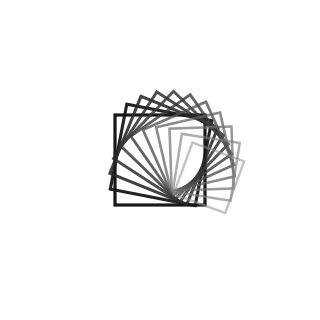

<div align="center">

<picture>
  <source media="(prefers-color-scheme: dark)" srcset="assets/logo-dark.svg">
  
</picture>

# Entropia

A compiled language for Windows position-independent x86-64 shellcode and Beacon Object Files.

[](LICENSE)
[](https://docs.entropykit.com)
[](#building-from-source)
[](#)
[](#status)

[**Documentation**](https://docs.entropykit.com) &nbsp;·&nbsp;
[**Project Setup**](https://docs.entropykit.com/getting-started/project-setup) &nbsp;·&nbsp;
[**CLI Reference**](https://docs.entropykit.com/getting-started/cli) &nbsp;·&nbsp;
[**Releases**](https://github.com/entropykit/entropia/releases)

</div>

---

## A complete BOF in less then 30 lines

```rust
use bof;
use_c "stdlib/win32/toolhelp.h";

fn go(args: char*, len: int) -> void {
    var snap: u64 = (u64)Kernel32.CreateToolhelp32Snapshot(TH32CS_SNAPPROCESS, 0);
    if snap == 0xFFFFFFFFFFFFFFFF { ret; }

    var pe: PROCESSENTRY32;
    pe.dwSize = (u32)sizeof(PROCESSENTRY32);

    var ok: int = Kernel32.Process32First((void*)snap, &pe);
    while ok != 0 {
        BeaconPrintf(CALLBACK_OUTPUT, str.format("[+] {d}  {s}\n",
                                                 (int)pe.th32ProcessID,
                                                 (char*)pe.szExeFile));
        ok = Kernel32.Process32Next((void*)snap, &pe);
    }
    Kernel32.CloseHandle((void*)snap);
    ret;
}
```

That is a complete `ps` BOF. The `use_c` line pulls the `PROCESSENTRY32`
struct and the `TH32CS_SNAPPROCESS` constant straight from the Windows SDK
header, so you write the snapshot kind by name instead of as a raw `0x2` and
the struct layout matches the Microsoft ABI byte for byte. No IAT to
hand-roll, no relocations to apply yourself. `Kernel32.X(...)` calls lower
to indirect calls through slots the runtime fills before user code runs.

---

## Quick start

```bash
git clone https://github.com/entropykit/entropia.git
cd entropia

# Build the workspace (3 binaries: entc, bof-runner, entc-debug)
cargo build --release

# Compile a BOF with the full OPSEC stack enabled
./target/release/entc compile example/bof_pslist.etpy --type=bof --opsec=all

# Run it under the local test harness
./target/release/bof-runner example/bin/bof_pslist.x64.o
```

For prebuilt binaries: grab them from
[GitHub Releases](https://github.com/entropykit/entropia/releases) and skip
the `cargo build` step. You can find full walkthrough including at
[docs.entropykit.com/getting-started/installation](https://docs.entropykit.com/getting-started/installation).

---

## Why does this exist

Most red-team artifacts ship through a build pipeline of three or four tools
chained together: a C compiler for the source, a linker, a
position-independence transform like DonutGen or sRDI, plus whatever you
wrote yourself to bolt OPSEC tricks on after the fact. Entropia compresses
that pipeline into a single compiler, while providing a modern high-level 
language feeling.

The output is the artifact you actually want, either a position-independent
shellcode blob or a Cobalt Strike Beacon Object File, with no post processing
step. The language is small enough to learn in an afternoon and complete
enough to ship production tooling in. The whole OPSEC stack
ships as compiler flags rather than post-build surgery.

Because the compiler owns the pipeline end to end, everything composes. A
hand-written PEB walk in `asm { ... }`, a `[Hook("LIB$Func")]` attribute,
a `[Stage(Init)]` startup hook, and `--opsec=all` share the same internal
representation and do not fight each other. The artifact you ship is the
artifact the compiler emitted, polymorphed by a per-build random seed so
two consecutive builds of the same source differ by 67 to 78 percent at
the byte level.

---

## Examples

### Shellcode (`fn main` entry)

```rust
use_c "winuser.h";

fn main() -> int {
    User32.MessageBoxA(0, "hello", "entropia", 0);
    ret 0;
}
```

```bash
entc compile hello.etpy            # writes hello.bin
entc-debug hello.bin               # run under the local loader
```

### BOF (`fn go` entry)

```rust
use bof;

fn go(args: char*, len: int) -> void {
    var parser: datap;
    BeaconDataParse(&parser, args, len);
    var target: char* = BeaconDataExtract(&parser, 0);
    BeaconPrintf(CALLBACK_OUTPUT, str.format("hello, {s}\n", target));
    ret;
}
```

```bash
entc compile hello.etpy --type=bof
bof-runner hello.x64.o --zarg "operator"
```

### Inline assembly + a real PEB walk

```rust
fn read_peb() -> u64 {
    var peb: u64;
    asm {
        mov rax, gs:[0x60];
        mov %peb, rax;
    }
    ret peb;
}
```

### OPSEC pre-flight in one line

```rust
use opsec_unhook;     // restores ntdll text section from disk
use opsec_etw;        // patches Etw* hot paths
use opsec_amsi;       // patches AmsiScanBuffer return

fn go(args: char*, len: int) -> void {
    // Pre-flight modules run before this line via [Stage(Init)].
    // Your code runs in a clean process.
    ret;
}
```

---

## The OPSEC stack

Every technique below is opt-in via `--opsec=<list>`. The build seed
(`--seed=random` is the default) drives every randomized choice.

| Flag | What it does | Mode |
|---|---|---|
| `poly` | Rewrites instructions after codegen. `xor` to `sub`, `mov MR` to `RM` to `lea`, `test` to `or` to `and`, NOP-run re-decomposition. | both |
| `nop_sled` | Pads every function entry with random multi-byte NOPs. Shifts every downstream byte offset so whole-binary fuzzy hashes drift between builds. | both |
| `strings_xor` | XOR-encrypts `.rdata` and `.data` with a per-build random key. Decryptor runs before user code. | shellcode |
| `stack_strings` | Materialises string constants on the stack rather than in `.rdata`. Eliminates plaintext strings from the artifact. | both |
| `direct_syscalls` | Auto-imports a HellsGate-style stub. Every `Ntdll.X(...)` dispatches via `syscall` inside our code region. | both |
| `indirect_syscalls` | Auto-imports an indirect-syscall stub. Every `Ntdll.X(...)` jumps to a `syscall;ret` gadget inside ntdll itself. | both |
| `hashed_imports` | Drops every `__imp_LIB$Func` external symbol from BOFs. Win32 imports resolve at runtime via PEB walk plus LoadLibraryA plus GetProcAddress. | BOF |

Stack spoofing (Draugr-style synthetic call frames) and operator-selectable
sleep masks are available as explicit `use opsec_stack_spoof;` and
`use opsec_sleep_mask;` imports.

> Measured byte-level diversity between two builds with `--opsec=all` and
> different seeds: **67 to 78 percent.** Well past every published fuzzy-hash
> threshold.

---

## What's in the box

| Binary | What it does |
|---|---|
| `entc` | The compiler. Takes `.etpy` source files, produces `.bin` shellcode or `.x64.o` BOFs. |
| `bof-runner` | Local test harness for BOFs. Applies relocations, fills the Beacon API stubs, calls `go(args, len)`. |
| `entc-debug` | Debug Adapter Protocol server. Powers VS Code F5 and F9. |
| `entc-win32gen` | Generates typed C headers from Microsoft's win32metadata. |
| VS Code extension | Syntax highlighting, F5 build-and-run, F9 breakpoints inside inline asm. Located at `tools/vscode-entropykit/`. |

---

## Building from source

### Requirements

- Rust 1.75 or newer ([rustup.rs](https://rustup.rs)).
- Windows x86-64 for running the produced binaries. The compiler itself builds
  and runs on Linux and macOS too, but the output targets Windows.

### Build everything

```bash
cargo build --release
```

Three binaries land under `target/release/`:

```
target/release/entc.exe
target/release/bof-runner.exe
target/release/entc-debug.exe
```

### Build a single binary

```bash
cargo build --release -p entropykit       # entc only
cargo build --release -p bof-runner       # local BOF harness only
cargo build --release -p entc-debug       # DAP server only
```

### Install the VS Code extension

```bash
python tools/vscode-entropykit/build.py install
```

Reload VS Code (Command Palette to "Developer: Reload Window") to pick it up.
Other actions (`uninstall`, `status`, `vsix`) are documented at
[docs.entropykit.com/getting-started/installation](https://docs.entropykit.com/getting-started/installation).

<small>Soon comming to VS Code marketplace</small>

---

## Documentation

Reference and guides live at
**[docs.entropykit.com](https://docs.entropykit.com)**.

| Section | What it covers |
|---|---|
| [Getting Started](https://docs.entropykit.com/getting-started/installation) | Install, project setup, first program, CLI reference, every compiler flag. |
| [Language](https://docs.entropykit.com/language/overview) | Types, control flow, structs, pointers, indexing, casts, try and catch, inline asm, intrinsics, garbage collector. |
| [Modules and Stdlib](https://docs.entropykit.com/modules/use) | `use` and `use_c`, what is in the standard library. |
| [Win32](https://docs.entropykit.com/win32/calling-apis) | How `Lib.Function(...)` calls work end to end. Custom resolvers. |
| [BOF Mode](https://docs.entropykit.com/bof/overview) | `go(args, len)`, Beacon API, auto-generated Aggressor scripts, local testing, F5 debugging. |
| [OPSEC](https://docs.entropykit.com/opsec/overview) | Every flag explained with examples and trade-offs. |
| [Advanced](https://docs.entropykit.com/advanced/overrides) | `[Override(Slot)]`, `[Hook(...)]`, lifecycle stages. |

A self-contained PDF snapshot of the docs ships with every tagged release.

---

## Status

Entropia is pre-1.0 and the surface is still moving. Expect changes between
commits to the compiler internals; the source-level language surface is
stable enough that the examples in this README are expected to keep working.

Roughly what is done and what is in flight:

| Area | Status |
|---|---|
| Compiler front end (lexer, parser, type checker) | Stable. |
| Codegen and encoder | Stable. New mnemonics get added as needed. |
| BOF mode | Stable. |
| Shellcode mode | Stable. |
| OPSEC stack (poly, syscalls, sleep masks, hashed imports) | Stable. |
| VS Code F5 / F9 flow | Stable. |
| Garbage collector | Stable. Manual mode is the recommended default for size-sensitive builds. |
| Linux / macOS toolchain support | Build-only. Generated artifacts always target Windows x86-64. |
| Tests | To be implemented. |
| ARM64 backend | Not started. |

---

## Contributing

Issues and pull requests are welcome. A few ground rules:

- **Bug reports**: include the smallest `.etpy` that reproduces the issue and
  the exact `entc compile` command line. Compiler bugs that fail at build time
  are easier to triage than runtime crashes; runtime crashes need the artifact
  and the host environment too.
- **New language features**: open an issue first to discuss the design. The
  language surface is small on purpose.
- **OPSEC techniques**: new `--opsec=*` flags or new `opsec_*` stdlib modules
  are encouraged. Pair the implementation with a stdlib example and a docs
  page explaining the trade-off.
- **Pre-commit**: run `cargo build --release` and `cargo test --release`
  before pushing. We will add a CI workflow that enforces this.

---

## Authorization and responsible use

Entropia is dual-use security tooling. The example BOFs implement
well-documented offensive primitives (process enumeration, token
impersonation, remote injection, LSASS dump, AMSI and ETW silencing) that
you can find in mainstream tradecraft references like nanodump, mimikatz,
TrustedSec's CS-Situational-Awareness-BOF collection, and Cobalt Strike's
stock BOF library.

Use Entropia only in authorized red-team engagements, CTF environments, and
security research. The authors assume no liability for misuse.

---

## Acknowledgments

Entropia stands on the shoulders of a community of public research:

- **Cobalt Strike** for defining the BOF format and the Beacon API surface.
- **TrustedSec** for the CS-Situational-Awareness-BOF collection and the
  COFFLoader reference.
- **nanodump**, **freshycalls**, **HellsGate**, **HalosGate**, **TartarusGate**
  for syscall-stub research.
- **Ekko**, **Foliage**, **Draugr** for sleep-mask and stack-spoofing
  techniques.
- **win32metadata** for the typed Win32 surface generation.

---

<div align="center">

[Documentation](https://docs.entropykit.com) &nbsp;·&nbsp;
[Releases](https://github.com/entropykit/entropia/releases) &nbsp;·&nbsp;
[EntropyKit](https://entropykit.com)

</div>
